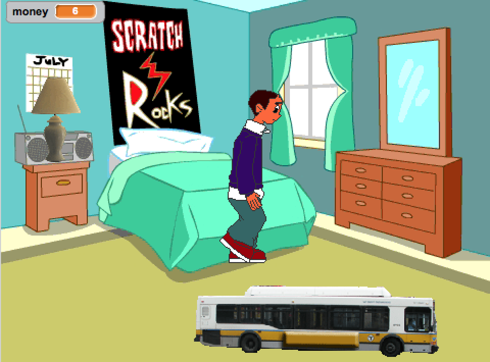
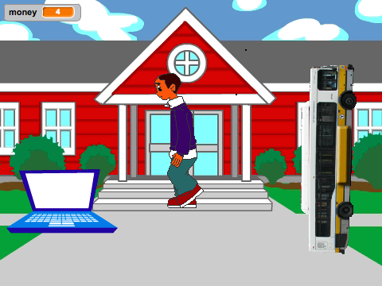
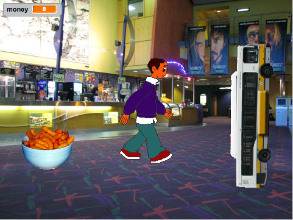
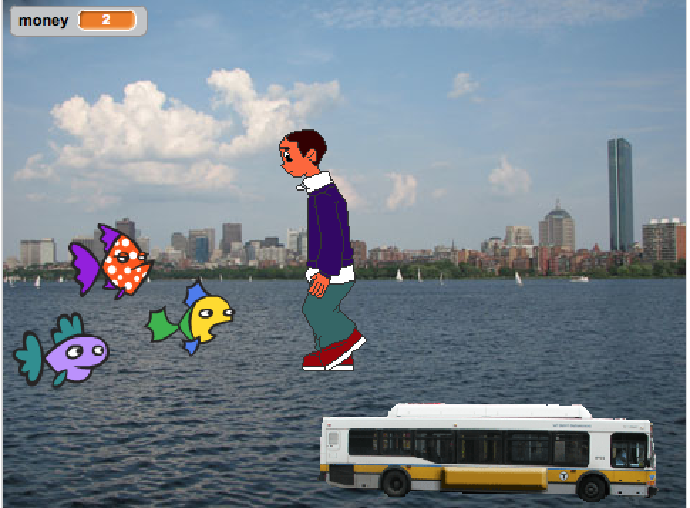
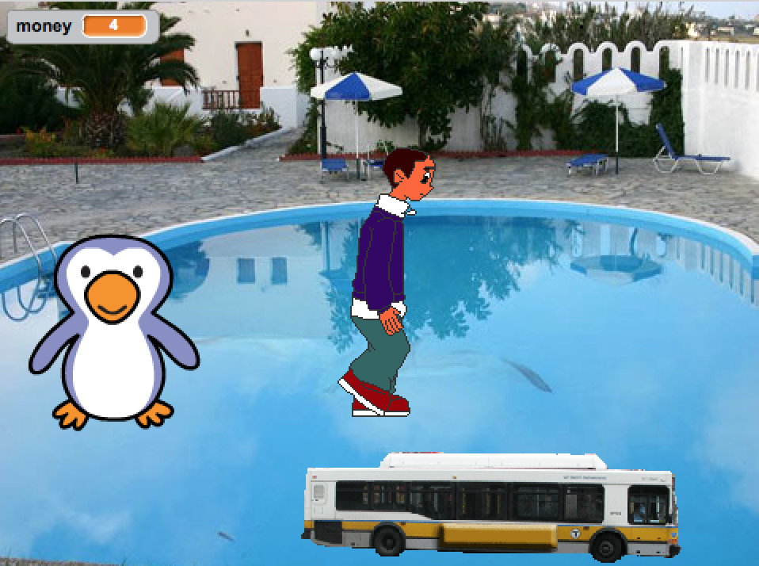

#Project 3: City Crossing
The purpose of this project is to utilize the language features of Scratch that you've learned thus far to implement a sim experience much like Nintendo's Animal Crossing. You'll create a program in which an avatar can explore, work, and play in the city, using advanced Scratch concepts like Lists, Custom Blocks, and Message Broadcasting.

#Due
End of Class Tuesday, December 23 to tealsteachers@gmail.com

#Part 1: Setup and Travel (30 points)
The city is a series of backdrops that the user can travel between. Set up the following backdrops, in order (5 points):
1. Home: Use "bedroom2" backdrop
2. The Movies: Use "the movies inside" backdrop
3. The Zoo: Use the "pool" backdrop
4. School: Use the "school1" backdrop
5. The Waterfront: Use the "city with water2" backdrop

You will control an avatar of your choosing, moving him or her left to right by pressing the arrow keys as in the mewo-rio project. The avatar must animate while walking. (5 points)

Create two global variables. One is "money" to represent how much money the avatar currently has. The default value is 10. The second is "fish", a list that contains an item for every fish that the avatar has caught. (5 points)

There is a bus to travel in between parts of the city (there is no subway sprite in Scratch!). It costs 2 dollars per ride. The bus can be controlled by the user when they walk their avatar onto it. Use the bus sprite and rotate it so that it can travel up and down between backdrops when the user hits the up and down arrow keys. When the bus reaches the bottom or top of the stage, the backdrop should change and the bus should automatically move to a natural location on screen to simulate scrolling. Also, any sprites relevant to a particular backdrop should only be shown with their backdrop. So, the Penguin should only be on screen at the same time as the Zoo backdrop. When the user presses the "X" key, the avatar should exit the bus so that it can walk around again. (15 points)

#Part 2: Home (5 points)

Add the "lamp" sprite. When the avatar touches the lamp, the lamp should say "goodnight". It is now the next day. When the user clicks the flag button to start the program, the avatar should show up here as the initial location. (5 points)

#Part 3: School (10 points)

Add the "laptop" sprite. When the avatar touches it, they can study for Intro to Comp Sci. The Laptop asks the user for a command. If the user types in "write", the laptop should ask them "What would you like to add to your notes?" The laptop should then store the input in a list. The second command the laptop can handle is "read". When the user types that in, the laptop will say all of the notes that have been typed in.

#Part 4: The Movies (20 points)

Add the "Cheesy Puffs" sprite. When the avatar touches this, they can buy snacks. The sprite asks the avatar what item they would like. The following menu items are for sale:
1. Popcorn - $3
2. Soda - $1
3. Candy - $2

The user can make their item "extra large" for an extra dollar. After the user types in the item they would like and if they would like extra large, the Cheesy Puffs sprite should use a block called "buy item (item name) is extra large (extra large)" to deduct the correct price of the item from the global "money" variable.

After the user buys one item, the Cheesy Puffs sprite should ask if they want anything else. The user can repeat the process as long as they wish, but be careful to not allow them to buy items if they don't have enough money.

#Part 5: The Waterfront (10 points)

The user can take the avatar fishing here. Make 3 fish sprites of different colors (set to 50% size or else they will be too big) If the user touches the fish, it is caught and the color of the fish is added to the avatar's "fish" list. The sprite then disappears, and will not reappear until the next day. So, the user can only catch 3 fish per day.

#Part 6: The Zoo (15 points)

The user can feed a penguin sprite here. The penguin only likes to eat yellow fish. If the avatar touches the penguin, it will ask if it can have a yellow fish. If the user says "yes" the penguin will eat the fish and then pay the user $4. This is how the user can earn momey to spend at the movies.

#Part 7: Style (10 points)
- Sprites have meaningful names.
- Variables have meaningful names and are correctly scoped.
- There are no unused blocks on the screen.
- You use comments to explain what your code is doing.

# Extra Credit (10)
- Add another backdrop of the city of your own creation (ask a teacher first) with a feature of its own, and add some code to implement the feature using custom blocks, lists, or message broadcasting. 